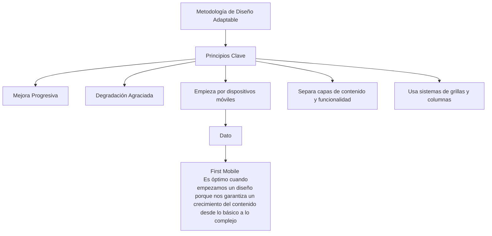
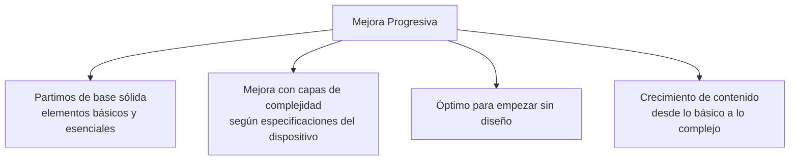
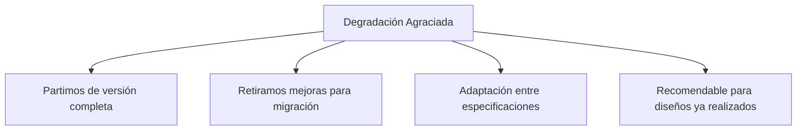
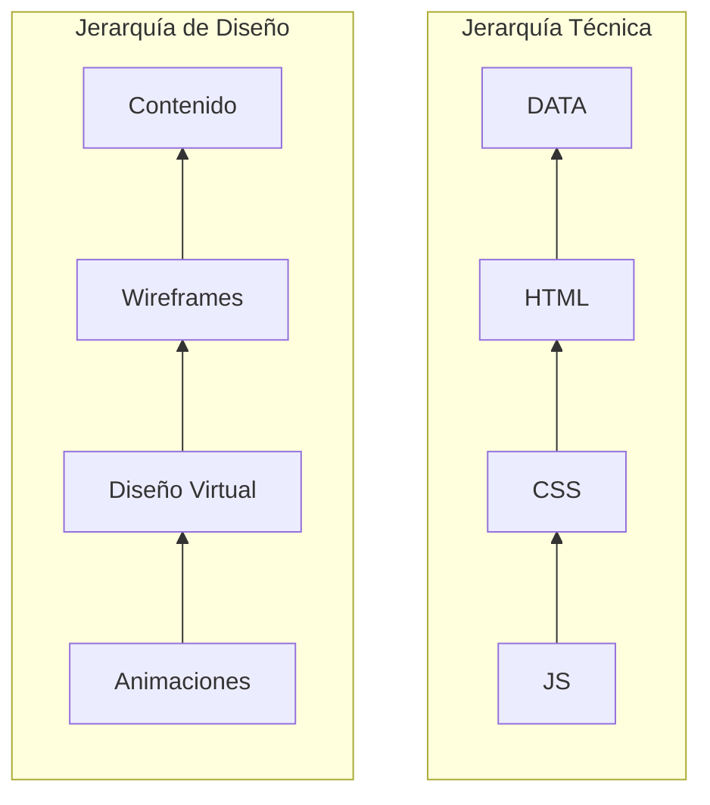
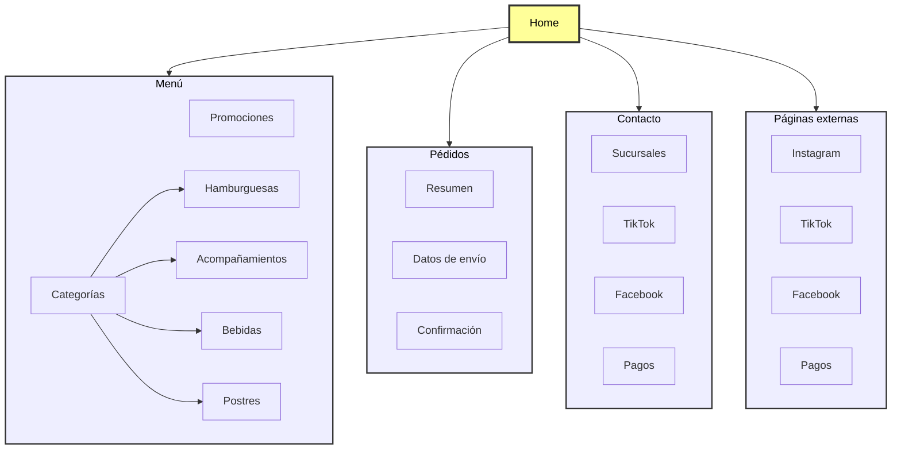
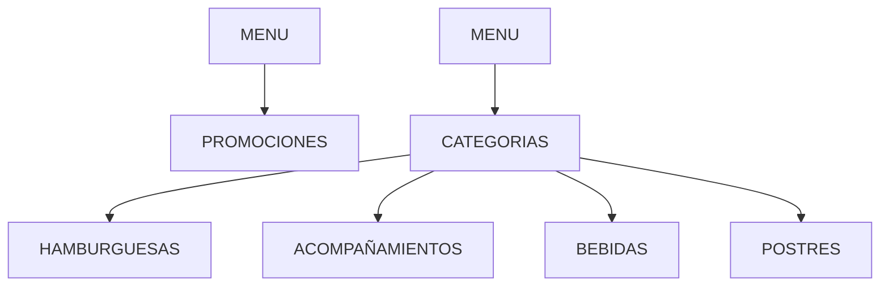
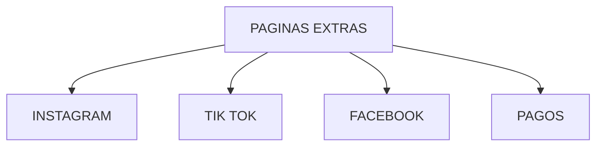
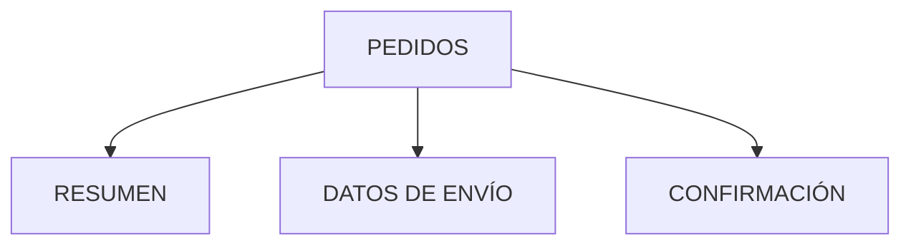
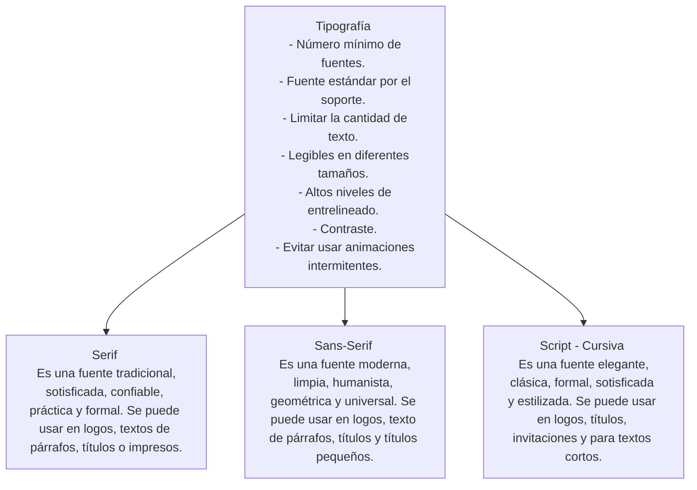

# **DISEÑO PARA DEVELOPERS**

## Clase 1

### Conceptos Básicos

1) Balance: La posición de cada elemento dad por su peso visual. El peso puede ser simétrico o asimétro.
2) Contraste: Esto puede señalar un concepto marcado por la diferencia de dos elementos distintos. Por ej.: Algo claro y algo oscuro.
3) Alineación: Crear rutas visuales, seguir una orientación que alinee nuestro diseño.
4) Proximidad: Saber agrupar nuestros elementos.
5) Repetición: Aquí podríamos hablar del concepto de marca.
6) Espacio: saber cómo usar el espacio que tenemos. Que se vea todo ordenado, que no refleje desorden ni genere incomodidad.

### Diseño Responsivo

Es una metodología que nos permite crear diferentes diseños que sean adaptables a diferentes dispositivos, ej.: celular, Tablet u ordenador.

#### ¿Cómo garantizamos que el diseño sea responsivo?

1. Para que sea adaptable debemos empezar por dispositivos móviles. Esto nos garantiza que partimos del contenido básico hasta el contenido más complejo. Cuando comenzamos a diseñar nuestro sitio web debemos hacerlo pensando cómo se vería en nuestro celular. Comenzando desde este punto vamos a encontrar mas complejidades que comenzando desde la pantalla de un ordenador.
2. Separamos la capa de contenido con de la de funcionalidad. Así aseguramos que el contenido esté accesible a todos los usuarios.
3. Usar sistema de grillas y columnas. Las columnas son referencias para dividir el ancho de la página. Así es más fácil el diseño. La grilla es como una rejilla en nuestro diseño, que no está visible sino va a generar las columnas y estas nos van a permitir medir el espacio desde un dispositivo celular, Tablet u ordenador.

#### Métodologías para el Diseño Responsivo

### Jerarquías

### Accesibilidad y Diseño

> La accesibilidad en el diseño te asegura el acceso a todas las personas sin importar alguna discapacidad esencial.

#### Tips:

1. HTML debe estar estructurado correctamente. Para que los lectores de pantalla puedan proporcionar un detalle acertado al usuario. La semántica es importante y ayuda al SEO:
   - **Utiliza los encabezados de manera ordenada para organizar la estructura**. Cuando maquetamos la jerarquía debe estar marcada para que cuando alguien navegue con el teclado entienda la importacia dentro de esta.
2. Al usar fuentes de menor tamaño evita que las personas con problemas de vista accedan a toda la información de nuestra página:
   - **Utiliza tamaños de fuente accesible**. Se debe utilizar tamaños de fuentes que puedan ser vistas por cualquier persona sin importar el dispositivo. Evitar tamaños pequeños.
3. Si se usan colores incorrectos puede llevar a información, textos o imágenes a que no sean visibles:
   - **Utiliza colores que tengan un contraste adecuado**. No todas las personas perciben el color de la misma forma, por ello los colores deben de diferenciarse del fondo usando un buen contraste.
4. Debemos evitar la categorización únicamente por colores. Cuando se agregan categorías por colores, se ve bonito y fácil. Pero si no se le agrega alguna alternativa extra como bordes o separaciones marcadas, puede dificultar la comprensión para algunas personas:
   - **Garantiza que el color no sea la única forma de relacionar con el contenido**. Debemos de tener una alternativa del aspecto del contenido cómo bordes para ser accesible a todos los usuarios.
5. No debemos dejar a un lado los estados Focus y Active en el HTML porque estos proporcionan una ayuda visual para que el usuario sepa en que parte de la página se encuentra:
   - **Diseña teniendo en cuenta los estados "Focus" y "Active" de los componentes**. Es importante porque es una guía visual de sus acciones.
6. Debemos agregar etiquetas y textos descriptivos a campos de formularios, videos, e imágenes:
   - **Añade etiquetas y textos descriptivos a campos de formulario**. La implementación de esto, ayuda que los usuarios tenga alguna descripción de algún error y pueda ser escuchado por el lector de pantalla.
7. Debemos evitar animaciones que bloqueen el contenido. Esto provoca que aquellos que no tienen acceso por ejemplo a un mouse, no obtenga la misma cantidad de información que aquellos que sí:
   - **Escribe contenido descriptivo que pueda reemplazar vídeos e imágenes**.
   - **Garantiza que las animaciones no bloqueen el acceso al contenido**. Priorizar que la funcionalidad de la página no se vea afectado por algún implemento de diseño.

### BRIEF y Requerimientos Técnicos

- El primer elemento que debemos tener en claro para construir una aplicación.
- El brief es la hoja de ruta para empezar a diseñar. Hay que investigar y recopilar la información relativa con el proyecto a solucionar. Es a donde apuntamos esos datos que hemos recopilado.
- Secciones:
  - Descripción de la empresa o cliente.
  - Objetivos o retos.
  - Target o audencia.
  - Competencia.
  - Distribución.
- Es importante que este documento, el brief, sea bonito, esté bien organizado. Que se pueda ver bien la jerarquía de contenido. Que la persona que lea nuestro brief, entienda lo que está leyendo.
- Los objetivos es la parte más importante porque de ahí vamos a partir para crear nuestro producto. Tener un cronograma con fecha de entregas.

#### Ejemplo de Brief

1. Logo

> Información de la empresa, descripción del cliente.
> ``

2. Objetivos
   ``
3. Target o audiencia al que está destinado el producto.
   ``
4. Competencia (con sus enlaces).
   ``
5. Forma de distribución.
   ``
6. Cronograma.
   ``

#### ¿Cómo hacer un Brief?

Para elaborar un buen brief debemos responder las siguientes preguntas:

1) ¿Cuál es la necesidad, desafío o problema que se va a solucionar?
2) ¿Qué se espera lograr?
3) ¿A quién se va a impactar?
4) ¿Cuáles son los beneficios que se va a obtener?
5) ¿Cómo se va a comunicar?

#### Tipos de Brief

- **Creativo**: Plasma un proyecto novedoso. Busca un insight e información clave desde la cual puede crear piezas publicitarias, generalmente un aviso en la tv, u otros medios como va vía pública, radio o redes sociales.
- **Publicitario**: Es parecido al anterior pero orientado al marketing. Resume una iniciativa de marketing concreta que quiere ponerse en marcha. Puede ser el lanzamiento de un nuevo producto, el nuevo sabor de una bebida, una festividad especial por ej.: el día de las madres o Black Friday o simplemente el posicionamiento de una marca.
- **Comunicación**: Contiene piezas claves para la estrategia de comunicación o relaciones públicas. Esto quiere decir que puede incluir activaciones, eventos con periodistas, trabajos con influencers.
- **Diseño**: Responde a un requerimiento que se busca resolver desde el área visual. Puede ser para un sitio, un newsletter, piezas para redes sociales, presentaciones, brochure institucionales, documentos descargables, blogs, landing pages etc. Generalmente contiene información técnica sobre los formatos y sus especificaciones.
- **Programación**: Contiene todo lo que necesita una empresa. Marca, profesional o emprendedor, y que se puede responder con un sitio, blog, herramienta o app. Tambien incluye los elementos que el cliente esperan del sitio, sus funcionalidades obligatorias y otros detalles.
  La respuesta de este tipo de brief se divide en dos. La primera va a ser el backend esto se orienta a como luce el sitio desde el punto de vista del programador. Y la otra es el frontend que se orienta a como luce para el usuario desde el diseño.
- **Negocio**: Es un documento que resume las necesidades y expectativas de un proyecto de negocio. Generalmente incluye información sobre el objetivo del proyecto, el público objetivo, el mensaje clave y el posicionamiento de la marca. Tambien puede incluir un análisis de la competencia, una estrategia de marketing, un plan de acción detallado. Esta es una herramienta importante para ayudar a las empresas a definir y enfocar sus esfuerzos de negocio y comunicar de manera clara y concisa sus objetivos y expectativas a todos los involucrados en el proyecto.

En el momento de recibir un brief de parte del cliente, debemos analizarlo si la solicitud del cliente es realmente lo que el/ella necesita. Con profundidad analizamos el pedido y pedimos clarificación si hiciera falta. Debemos asesorarlo y gestionar y presentar algo diferente a lo solicitado y justificar para brindarle más peso a la decisión que nosotros queremos introducir al cliente.

Deberemos reescribir ese brief para que quede aún más claro para el cliente y para nosotros.

Tambien necesitamos aprovechar el uso de la herramienta del brief por ejemplo en marketing, por más sencillo que sea el pedido, veremos que podremos experimentar una mayor eficacia en el empleo del tiempo y nivel de efectividad a la hora de transmitir lo que necesitamos.

---

## Clase 2

### UX - Experiencia de Usuario

Debemos diseñar nuestro software para que sea amigable con el usuario. Este diseño se centra en los usuarios y en la usabilidad.

El diseño UX tiene varias etapas.

1. **Investigación**: Recopilamos datos de como se comporta el usuario y como usa otras apps similares o apps existentes.
2. **Análisis**: Seleccionamos y agrupamos la información según los objetivos hacia el usuario.
3. **Diseño**: Creamos prototipos, flujos de usuarios para visualizar las mejores practicas para el producto final.
4. **Pruebas de usuarios**: Se realizan pruebas con sketches, en papel o con demos para ver la interacción del usuario con el producto sin ser el diseño final. Esto nos permite ajustar nuestro diseño antes de pasar a la etapa de desarrollo.

El primer paso de nuestro diseño ux es el diagrama de flujo, pasamos el contenido del brief a elementos tangibles. El primer diagrama es el site-map es el mapa de nuestro sitio. Aquí se definen las secciones principales, las secundarias y paginas externas.

Al realizar el diagrama de flujo, debemos tener en cuenta el objetivo que quiere lograr nuestro cliente, por ejemplo, dar a conocer sus productos. Conociendo esos requerimientos, diseñamos el diagrama de flujo con:

Otro objetivo del cliente es aumentar su presencia en línea, por lo mismo trabajamos con

Nuestro cliente quiere que realicen pedidos on-line por lo que agregamos:

Agregamos **CONTACTO > SUCURSALES** para que nuestro cliente de a conocer su marca.

El user-flow es el diagrama de los pasos que va a hacer el usuario para completar una tarea. Con este flujo podemos saber cuantas pantallas o componentes necesitamos para las acciones del usuario. No hay un numero definido de pantallas o componentes que vamos a diseñar.

| DIAGRAMAS DE FLUJO                                                        | WIREFRAMES                                                         |
| ------------------------------------------------------------------------- | ------------------------------------------------------------------ |
| Nos permite llevar requerimientos de nuestros Brief a elementos tangibles | Son planos o bosquejos de nuestra aplicación                      |
|                                                                           | Tiene dos tipos: Bajo nivel (a mano) y alto nivel (en un programa) |

#### Wireframes: Web

#### Wireframes: Mobile

 

El wireframe es el plano de nuestra aplicación, es un boceto de todos los componentes y pantallas que va a tener nuestra aplicación que previamente salieron el los diagramas de flujos y los user-flows. Los wireframes pueden ser de bajo nivel (hechos a mano en lápiz y papel) y los de alto nivel (son creados en programas de diseño como figma-miro-canva).

Es importante esta herramienta para los desarrolladores ya que les da una idea de la dimensión de la aplicación final y van a poder hacer estimaciones, además de decidir con que tecnologías y herramientas trabajar. Es importante también para el cliente porque va a ver que secciones va a tener su página/app con este wireframe como si fuera un producto terminado. No se usan paletas de colores. Solo escala de grises.

#### Definición del diseño UI – Interfaz de usuario

Este diseño se enfoca en la capa de estilos visuales que va por encima de la estructura de contenido. Se diferencia del diseño UX en que este ultimo se centra en la investigación, prototipado y arquitectura de la información., se encarga del diseño de interacción y pruebas de usuarios mientras que el UI se enfoca en el diseño visual, colores, layout, tipografía.

Cuando trabajamos con ambos diseños al mismo tiempo garantizamos que nuestra aplicación sea atractiva al usuario, agradable y funcional.

No se le debe restar importancia a ninguno de los dos tipos de diseños.

#### MoodBoard

Referencias orientativas de otras páginas webs, diseños, formatos, imágenes, palabras. Pueden ser físicas como recortes de revistas, paginas impresas o pueden ser digitales.

Por ejemplo: muro de Pinterest donde de un tema en común se aglutinan imágenes e información que sirve para inspirar y tener ideas.

> Su traducción literal es mapa de inspiración, un moodboard es una colección de referencias visuales, un tablero o documento.

> Empezamos a recopilar referencias, es una herramienta creativa que consiste en una visualización rápida de imágenes y palabras de un mismo soporte.

#### Teoría del Color

Para saber cuales colores son los adecuados para un diseño, aplicamos lo que es la teoría del color. Esta tiene que ver con lo que es la psicología del color que es un área de estudia lo que el cerebro percibe y asocia a conceptos y sentimientos. Entonces se puede decir que los colores se asocian a sentimientos como por ej.: el color rojo se asocia a la pasión, comida, deportes, sexo, ira, entretenimiento, amor, calor, poder, espontaneidad, peligro, etc.

Para diseñar una app debemos tener en cuenta como trabajar la paleta de colores:

- Utiliza colores RGB (pantalla) y hexadecimales.
- Define una paleta de color.

- Crea un código de color consistente. **Menos es más**. No usar tantos colores, esto distrae a los usuarios y no los enfoca en sus acciones.
- Asegura que tu elección de color sea accesible.

 

Al diseñar nuestra página web, es muy útil crear un archivo con los códigos de nuestra paleta de colores y añadirla a nuestro css.

Para construir nuestra paleta de colores, es necesario saber que colores existen.

Colores primarios como azul, amarillo, rojo, blanco y negro. Tambien están los colores secundarios son el resultado de la combinación de los colores primarios. Los colores terciarios son los colores intermedios que hay entre los colores primarios y secundarios

- Tipos de paleta de combinaciones:
  - **Monocromática**: Son diferentes tonos de un solo color, pero con diferente opacidad.

- **Análoga**: Esta resulta de combinar un color primario con un color secundario y otro terciario que sean contiguos en el círculo cromático.

- **Complementaria**: Consiste en combinar un color primario con otro secundario pero que estén opuestos en el círculo cromático.

- **Triádica**: Se trata de combinar tres colores que estén en el circulo cromático de forma que formen un triángulo entre ellas.

- **Tétrada**: Se combinan 4 colores en las que entre ellos se forma un rectángulo en el círculo cromático.

#### Crear Paletas de Colores

- Tipografías:

# **Consejos para el uso de tipografías en aplicaciones**

* **Evita usar muchas fuentes:** Limita el número de tipografías y, si es posible, usa las fuentes estándar para asegurar una buena compatibilidad y soporte.
* **Limita la cantidad de texto:** Las aplicaciones no son libros. Demasiado texto puede ahuyentar a los usuarios, ya que hoy en día la gente prefiere contenido más visual y conciso.
* **Asegura la legibilidad:** Los textos deben ser fáciles de leer en diferentes tamaños de pantalla, ya sea en un celular, una tableta o un ordenador.
* **Alto nivel de interlineado:** Mantén un espacio adecuado entre las líneas para que el texto sea más fácil de escanear y leer.
* **Alto contraste:** Asegúrate de que haya suficiente contraste entre el color del texto y el fondo. El color amarillo sobre blanco es un ejemplo de una combinación poco legible que debes evitar.
* **Evita animaciones intermitentes:** Las animaciones parpadeantes en el texto pueden distraer y dificultar la lectura.

## **La psicología de la tipografía y sus combinaciones**

Las tipografías tienen una personalidad que puede evocar diferentes emociones y percepciones, similar a la psicología del color. Se presentan cinco tipos principales de tipografías:

* **Serif:** Es una tipografía tradicional, sofisticada y confiable. Es ideal para textos largos y se usa a menudo en documentos corporativos e institucionales. Un ejemplo es la tipografía que usa Google.
* **Sans Serif:** Moderna, limpia y minimalista. Es apropiada para carteles y títulos, y se asocia con la seguridad y la neutralidad. LinkedIn es un ejemplo de marca que la utiliza.
* **Script (Cursiva):** Representa elegancia, creatividad y seducción. Es perfecta para títulos, firmas e invitaciones. Marcas como Cadillac la usan en sus logos.
* **Moderna:** Aporta un sentido de tecnología, estilo y futurismo. Marcas como Absolut Vodka la emplean para proyectar una imagen vanguardista.
* **Decorativa:** Divertida, casual y exclusiva. Se usa para añadir personalidad y a menudo se encuentra en logotipos de marcas como Disney.

Además, se mencionan reglas para combinar fuentes, divididas en tres categorías principales:

* **Serif:** Tradicional, confiable y formal. Se usa en logos, párrafos y títulos.
* **Sans Serif:** Moderna y limpia. Ideal para logos, párrafos, y títulos pequeños.
* **Script:** Elegante y estilizada. Se usa en logos, títulos, invitaciones y textos cortos.

# Clase 3

# Layout y Grillas

## **¿Qué es una grilla?**

Una grilla, o rejilla, es un sistema de columnas que un diseñador o desarrollador crea para organizar y alinear los elementos y componentes en una página web. Este sistema es crucial para asegurar que el diseño se vea bien en distintos tamaños de pantalla (diseño responsivo). Además, el uso de grillas facilita y agiliza la escritura de código CSS.

## **Breakpoints y Mixins**

Los **breakpoints** son los puntos de ruptura en un diseño responsivo, que corresponden a diferentes tamaños de pantalla. Para gestionar estos puntos de manera más eficiente, se pueden usar **mixins** dentro de un preprocesador CSS. Un mixin es una clase que ayuda a manejar la configuración de estos breakpoints de forma más sencilla.

En el video, se sugieren los siguientes breakpoints y sus variables asociadas:

* `$XS`: 360px (para móviles pequeños).
* `$S`: 440px (para móviles más grandes).
* `$M`: 768px (para tablets).
* `$L`: 1280px (para ordenadores con pantalla normal).
* `$XL`: 1440px y más (para monitores de alta calidad).

## **Configuración de la grilla**

La configuración de una grilla implica el uso de variables y clases específicas:

* `columns`: Variable para definir el número total de columnas.
* `gap`: Variable para establecer el espacio entre las columnas.
* `clase .grid`: Se crea una clase llamada `grid` para los elementos contenedores de la página.
* `display: grid`: Esta propiedad de CSS se aplica a la clase `.grid` para que la configuración de la grilla tenga efecto.
* `grid-column-gap`: Define la distancia entre las columnas.
* `grid-template`: Permite definir la estructura y el tamaño de los componentes. Por ejemplo, `grid-column: 1 / 5` indica que un elemento comienza en la columna 1 y termina en la 5.

# ¿Qué es un sistema de componentes UI?

Un sistema de componentes UI es una metodología para construir aplicaciones dividiendo sus funcionalidades en partes independientes y reutilizables. Estos componentes actúan como una biblioteca de elementos (como un botón o una sección de menú) que puedes usar para armar tu aplicación.

## Características y beneficios

La clave de esta metodología es encapsular la funcionalidad de cada elemento. Cada componente tiene su propio CSS y su propia lógica. Esto te permite:

**Reutilizar código:** Puedes importar y usar el mismo componente en múltiples partes de tu aplicación sin tener que reescribir código.

**Aumentar la eficiencia:** Al trabajar con componentes individuales, el desarrollo se vuelve más rápido.

**Simplificar el mantenimiento:** Si necesitas modificar algo en un componente, como la portada, el cambio no afectará a otros componentes como la sección de contacto. Esto hace que las actualizaciones y el mantenimiento sean mucho más sencillos.

## Flujo de trabajo con componentes

El proceso de diseño comienza con un wireframe (un boceto básico de la estructura de la aplicación). A partir de este, se identifican las distintas secciones de la página y se dividen en componentes funcionales. Después de definir estos componentes, se les añade la capa visual. Finalmente, se recomienda crear una guía de estilo (style guide), que es una página de muestra donde se presentan todos los componentes y sus estilos CSS, asegurando así la coherencia visual de la aplicación.

# ¿Qué es un Theme (tema)?

Un **theme** es una capa de color y estilo que se aplica sobre una aplicación para modificar su apariencia visual. Permite tener diferentes variaciones de diseño sin necesidad de realizar cambios drásticos en el código principal.

## **Funcionamiento y beneficios**

Para implementar múltiples temas, se crea un **archivo CSS** separado para cada uno. El cambio entre temas se gestiona desde un archivo de configuración principal, donde simplemente se cambia el nombre del archivo del tema que se desea usar. Esto ofrece un método muy eficiente para personalizar el diseño, ya que no tienes que modificar todo el código de la aplicación cada vez que quieres cambiar la apariencia.

La manera más sencilla de crear temas es utilizando  **variables de CSS o de Sass** . Las variables de Sass son especialmente recomendadas por su simplicidad. Al usar esta metodología, puedes tener dos o más presentaciones visuales para tu aplicación, lo que te permite ofrecer una experiencia más personalizada o adaptada a las preferencias del usuario, como un modo claro y un modo oscuro.

# **Formatos de Imágenes Web**

Elegir el formato de imagen adecuado es crucial para el rendimiento de una página. Los formatos principales son:

* **JPG:** Ideal para fotografías y imágenes con degradados de color. Son archivos menos pesados, lo que ayuda a una carga más rápida.
* **PNG:** Se usa para imágenes que necesitan un fondo transparente, como íconos o logos. Son más pesados que los JPG.
* **SVG:** Un formato vectorial, perfecto para íconos y animaciones. Una de sus mayores ventajas es que se puede editar sus propiedades (como el color o el tamaño) directamente con CSS.
* **GIF:** No se recomienda para animaciones largas en la web debido a su gran tamaño de archivo.

## **Criterios para Elegir Imágenes**

Para que las imágenes refuercen tu mensaje, considera estos puntos:

* Deben **aportar valor** al contenido, no solo ser decorativas.
* Deben reflejar a tu  **público objetivo** .
* Deben ser **consistentes** con la paleta de colores y el tema de tu sitio web.

## **Rendimiento y Accesibilidad**

Además de la elección del formato, hay otras consideraciones importantes para mejorar el rendimiento y la accesibilidad de tu sitio:

* **Evita texto en las imágenes:** Los lectores de pantalla no pueden leer el texto incrustado en una imagen, lo que afecta la accesibilidad.
* **Ajusta el tamaño:** Exporta las imágenes al tamaño exacto en que se mostrarán en su contenedor. Redimensionar imágenes muy grandes con CSS puede arruinar su calidad y aumenta innecesariamente el tiempo de carga.
* **Usa lazy loading:** Esta estrategia carga las imágenes solo cuando el usuario se desplaza hacia ellas. Esto reduce significativamente el tiempo de carga inicial de la página.
* **Añade texto alternativo (alt text):** Es crucial incluir una descripción en el atributo `alt` de cada imagen. Este texto es leído por lectores de pantalla, haciendo que tu contenido sea accesible para personas con discapacidades visuales.

# **Formatos para Gráficos en Movimiento**

La elección del formato correcto es crucial para el rendimiento del sitio. Los formatos principales son:

* **CSS animado:** Ideal para animaciones sencillas y transiciones. Es un método ligero y eficiente.
* **SVG animado:** Se usa para animaciones de elementos vectoriales. Como es vectorial, puede escalarse sin perder calidad.
* **JavaScript (Canvas o WebGL):** Utilizado para animaciones más complejas, como las animaciones 2D y de datos. Existen librerías de JavaScript que facilitan este tipo de trabajo.

## **Uso de Videos en Sitios Web**

Los videos deben usarse con cautela, ya que son archivos muy pesados que pueden ralentizar la carga del sitio. Debes preguntarte si el video es realmente necesario. Los videos largos (por ejemplo, de 30 minutos) no son recomendables. Si se utilizan, deben ser muy cortos, precisos y claros.

## **Consejos para Elegir Gráficos en Movimiento**

Para asegurar una buena experiencia de usuario y accesibilidad, ten en cuenta los siguientes consejos:

* **Aportar valor:** Las animaciones deben sumar al contenido, no ser solo decorativas.
* **Evitar la reproducción automática y el sonido:** Si una animación o video se reproduce automáticamente, no debe tener sonido. Proporciona subtítulos o transcripciones para que los usuarios puedan entender el contenido sin audio.
* **Cuidado con los destellos:** Evita las animaciones con flashes. Los brillos continuos pueden molestar y ser perjudiciales para personas con ciertas condiciones de salud como la epilepsia o el autismo.
* **No bloquear el contenido:** Las animaciones no deben obstruir el texto principal ni desviar la atención del usuario. Esto también dificulta el acceso para los lectores de pantalla.
* **"Menos es más":** Recuerda que las animaciones y videos afectan el tiempo de carga de la página. Úsalos con moderación y con un propósito claro.

# **Pasos del Diseño para Programadores**

Los pasos principales para el diseño de una aplicación o página web son:

1. **Crear el Brief:** Define los objetivos del proyecto de manera clara y concisa.
2. **Crear el Sitemap:** Estructura la aplicación basándose en los objetivos definidos en el brief.
3. **Crear el User Flow:** Mapea las tareas más comunes que un usuario realizará en la aplicación, como un diagrama de flujo. Se pueden crear varios user flows según sea necesario.
4. **Dibujar Wireframes de baja fidelidad:** Utiliza papel y lápiz para crear bocetos iniciales que se puedan modificar rápidamente.
5. **Crear Wireframes de alta fidelidad:** Una vez que los bocetos de baja fidelidad se hayan probado y ajustado, se crean wireframes detallados para diferentes dispositivos (escritorio, móvil, etc.).
6. **Probar el diseño con colores y tipografías:** Aplica colores, tipografías y otros elementos visuales al diseño, basándote en un  **style guide** . En esta etapa, es importante considerar la psicología del color y la tipografía para mejorar la experiencia del usuario.
7. **Crear componentes:** Divide el diseño en módulos separados para facilitar la **reutilización** y el mantenimiento del código. Se pueden usar variables de CSS para cambiar fácilmente elementos como la paleta de colores.

Estos pasos están diseñados para guiar a los programadores a través de un proceso de diseño estructurado, que va desde la planificación inicial hasta la creación de componentes modulares y eficientes.

---

## BIBLIOGRAFÍA

- https://miro.com/app/board/o9J_kqXgfLs=/
